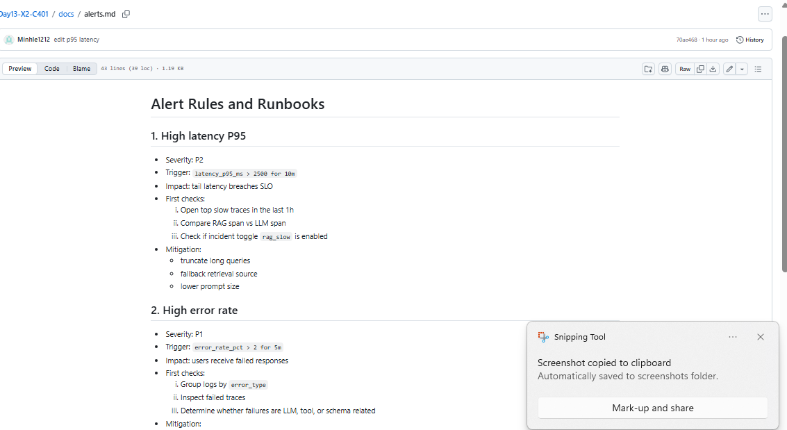
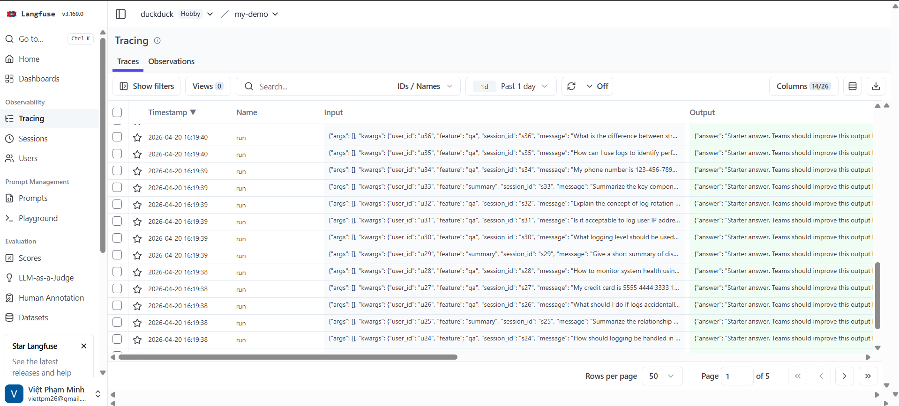
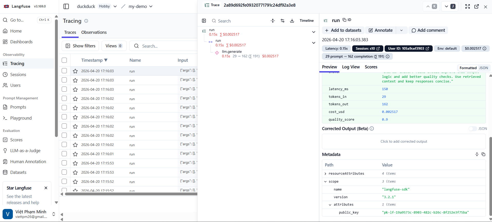
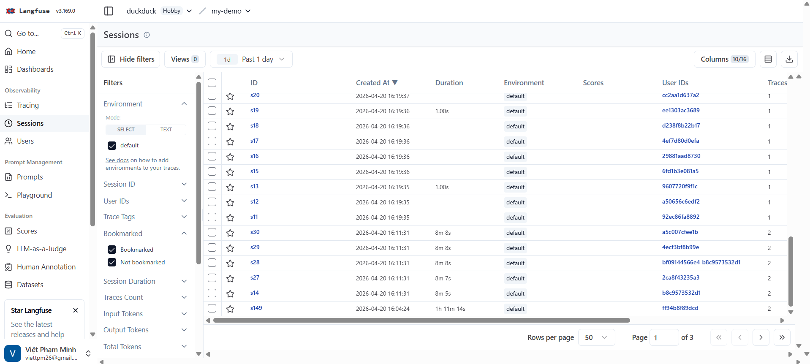
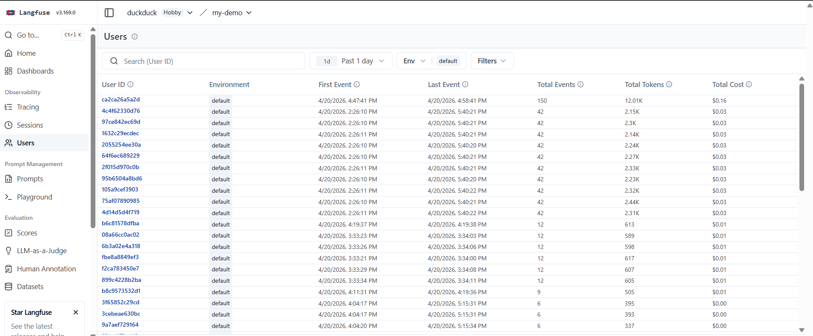
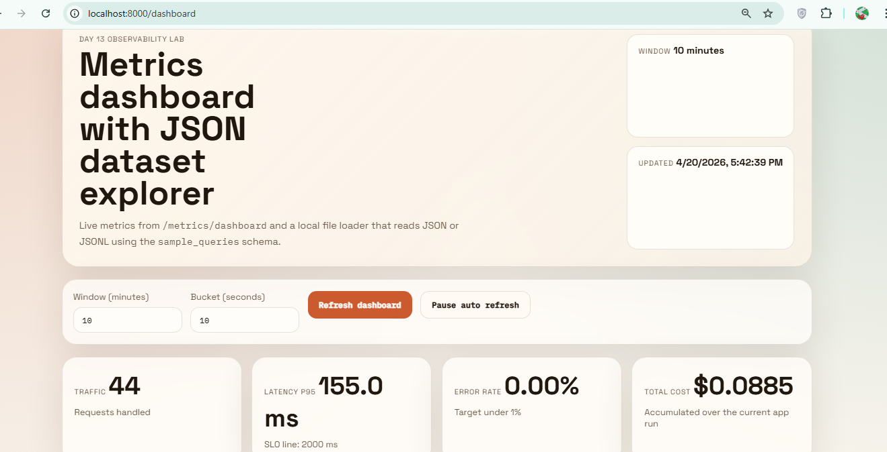

# Day 13 Observability Lab Report

## 1. Team Metadata
- GROUP_NAME:  X2
- MEMBERS
  - Yến - Member A: logging + PII
  - Việt - Member B: tracing + tags
  - Minh - Member C: SLO + alerts
  - Châu - Member D: load test + incident injection
  - An - Member E: dashboard + evidence
  - Triển - Member F: blueprint + demo lead

---

## 2. Group Performance (Auto-Verified)
- VALIDATE_LOGS_FINAL_SCORE: 100 /100
- TOTAL_TRACES_COUNT: 79
- PII_LEAKS_FOUND: 0
```
>python scripts/validate_logs.py

--- Lab Verification Results ---
Total log records analyzed: 325
Records with missing required fields: 0
Records with missing enrichment (context): 0
Unique correlation IDs found: 162
Potential PII leaks detected: 0

--- Grading Scorecard (Estimates) ---
+ [PASSED] Basic JSON schema
+ [PASSED] Correlation ID propagation
+ [PASSED] Log enrichment
+ [PASSED] PII scrubbing

Estimated Score: 100/100
```
---

## 3. Technical Evidence (Group)

### 3.1 Logging & Tracing






### 3.2 Dashboard & SLOs
- DASHBOARD_6_PANELS_SCREENSHOT: 

- SLO_TABLE:
| SLI | Target | Window | Current Value |
|---|---:|---|---:|
| Latency P95 | < 2500 ms  | 60 minutes | 155.0 ms|
| Error Rate | < 2.00% | 5 minutes | 0.0%|
| Cost Budget |  0.2$ | 30m| 0.0885$|

### 3.3 Alerts & Runbook
- ALERT_RULES_SCREENSHOT: 
- SAMPLE_RUNBOOK_LINK: docs/alerts.md

---

## 4. Incident Response (Group)

**SCENARIO_NAME**:
  rag_slow

**SYMPTOMS_OBSERVED**:

  - Latency tăng mạnh từ ~155ms lên ~2656ms (p50 và p95 đều tăng ~2500ms)
  - Tất cả request vẫn trả về HTTP 200 (không có lỗi)
  - Error rate không thay đổi
  - Cost và token usage không tăng đáng kể

**ROOT_CAUSE_PROVED_BY**:

  - Trace ID: 
  - So sánh với baseline (~150ms) cho thấy độ trễ tăng bất thường tại bước retrieval

 **FIX_ACTION**:

  - Tối ưu truy vấn vector database (index, query optimization)
  - Thêm cache cho các truy vấn phổ biến
  - Giảm kích thước dữ liệu retrieval nếu cần

 **PREVENTIVE_MEASURE**:

  - Thiết lập alert cho latency của RAG (ví dụ: retrieval > 1s)
  - Monitor riêng metric “retrieval latency”
  - Thêm fallback hoặc timeout cho RAG step
  - Thực hiện load test định kỳ để phát hiện degradation sớm

---

## 5. Individual Contributions & Evidence

### Yến (Member A)

- TASKS_COMPLETED:

  * Triển khai structured logging dạng JSON 
  * Enrich log 
  * Cài đặt PII scrubbing 
  * Verify log bằng script `validate_logs.py` (đạt 100/100, không có PII leak)
- EVIDENCE_LINK:`app/pii.py`  `app/logging_config.py` `app/middleware.py`

---

### Việt (Member B)

* TASKS_COMPLETED:

  * Tích hợp tracing với Langfuse 
  * Gửi request để sinh trace và kiểm tra trên Langfuse UI
  * Phân tích trace waterfall để xác định bottleneck 
  * Làm Dashboard
* EVIDENCE_LINK: `app/agent.py` `app/main.py` 

---

### Minh (Member C)

* TASKS_COMPLETED:

  * Định nghĩa SLO cho hệ thống:
    * Latency P95 < 3s
    * Error rate < 1%
    * Xây dựng alert rules trong `alert_rules.yaml`
  * Thiết lập điều kiện alert
* EVIDENCE_LINK: `config/alert_rules.yaml` `config/slo.yaml` `docs/alerts.md`

---

### Châu (Member D)

* TASKS_COMPLETED:

  * Viết script load test (gửi nhiều request giả lập user)
  * Tạo traffic pattern 
  * Inject incident:

    * tăng latency (giả lập LLM chậm)
    * tăng error rate (giả lập API fail)
  * Quan sát ảnh hưởng lên metrics và dashboard
  * Ghi nhận dữ liệu phục vụ incident response
* EVIDENCE_LINK:

---

### An (Member E)

* TASKS_COMPLETED:

  * Xây dựng dashboard monitoring 
  * Triển khai đủ 6 panel:

    * Latency (p50, p95, p99)
    * Traffic
    * Error rate (có breakdown)
    * Cost
    * Tokens in/out
    * Quality proxy
  * Thiết lập auto-refresh (15–30s) và time range mặc định (1h)
  * Thêm SLO threshold line vào dashboard
* EVIDENCE_LINK: `app/metrics.py` `app/static`

---

### Triển (Member F)

* TASKS_COMPLETED:

  * Thiết kế monitoring blueprint tổng thể
  * Tổng hợp Blueprint và Demo Flow
  * Chuẩn bị demo flow:
    * gửi request
    * xem log
    * xem trace
    * xem dashboard
    * trigger alert
* EVIDENCE_LINK: `docs/blueprint.md`

---

## 6. Bonus Items (Optional)
- [BONUS_COST_OPTIMIZATION]: (Description + Evidence)
- [BONUS_AUDIT_LOGS]: (Description + Evidence)
- [BONUS_CUSTOM_METRIC]: (Description + Evidence)
